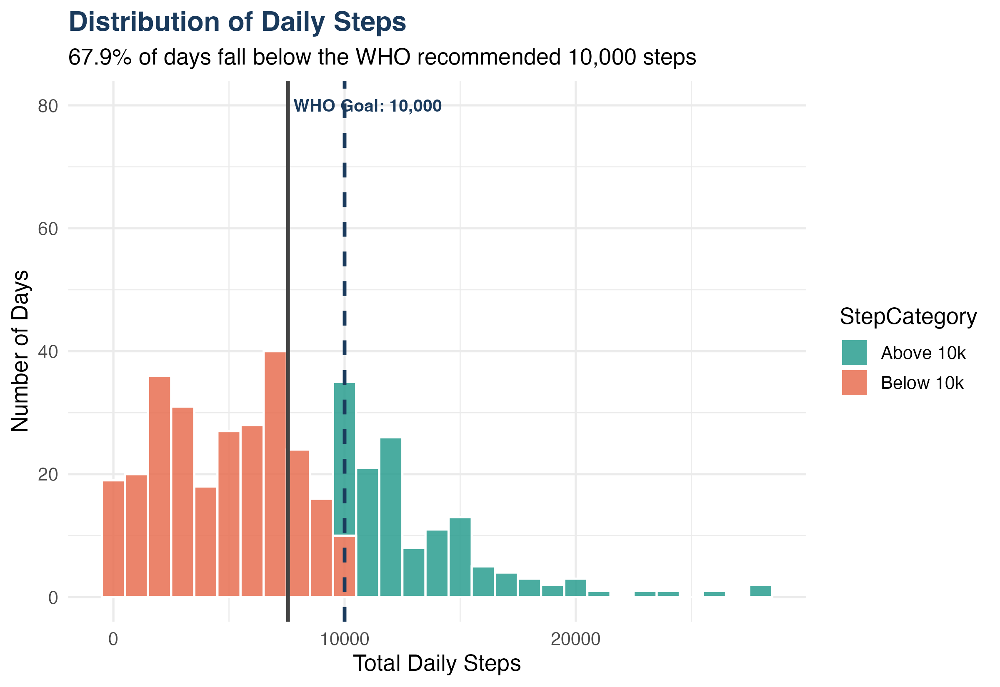
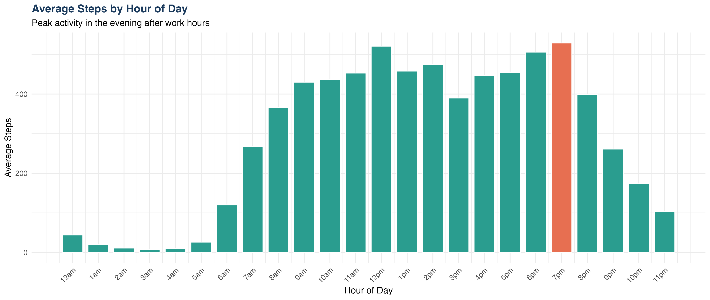
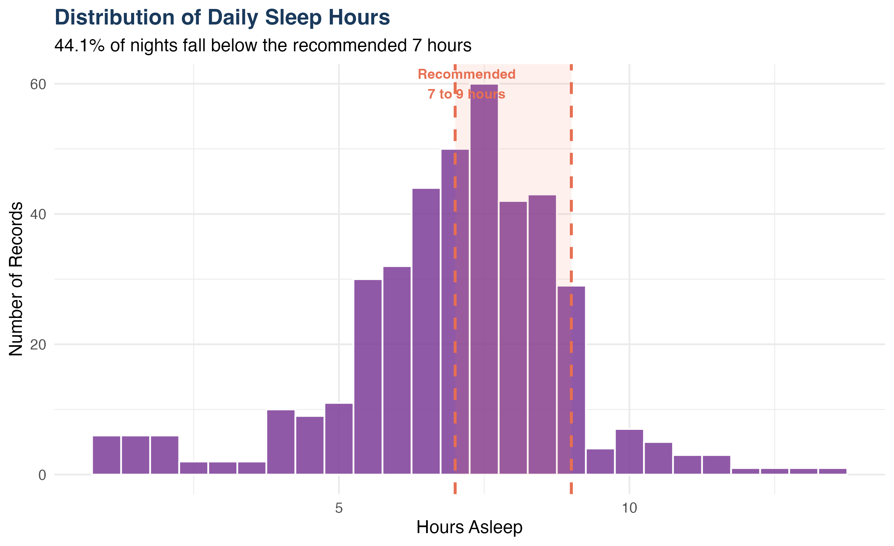

# Bellabeat Smart Device Analysis
### Google Data Analytics Capstone Project

**Analyst:** Hamza Salahuddin /n
**Certificate:** Google Data Analytics Professional Certificate

---

## Overview
Analyzed real FitBit smart device usage data from 34 users 
to identify behavioral trends and deliver five data backed 
marketing recommendations for Bellabeat, a women's wellness 
technology company.

---

## Business Task
Identify trends in smart device usage and apply insights 
to improve Bellabeat's marketing strategy for their app.

---

## Key Findings
- 67.9% of days fell below the WHO 10,000 step goal
- Peak activity occurs at 6 to 7pm daily
- 44.1% of nights had less than 7 hours of sleep
- Users averaged 15.7 hours of sedentary time per day
- Only 32% of users tracked their weight

---

## Tools Used
- SQL via BigQuery : data cleaning and exploration
- R with ggplot2 : analysis and visualization
- Tableau Public : interactive dashboard

---

## Project Structure
```
sql/
  01_exploration.sql
  02_cleaning.sql
r/
  bellabeat_analysis.R
visualizations/
  01_steps_distribution.png
  02_steps_by_day.png
  03_hourly_steps.png
  04_steps_vs_calories.png
  05_sleep_distribution.png
  06_sleep_efficiency.png
  07_user_segments.png
  08_activity_minutes.png
  09_weight_tracking.png
report/

Bellabeat_Case_Study_Hamza_Salahuddin.pdf
```

---

## Visualizations






---

## Links
- Kaggle Notebook : 
- Tableau Dashboard : https://public.tableau.com/app/profile/hamza.salahuddin/viz/BellabeatSmartDeviceAnalysisHS/Dashboard1
- LinkedIn Post :

---

## Dataset
FitBit Fitness Tracker Data
Source : kaggle.com/datasets/arashnic/fitbit
License : CC0 Public Domain
